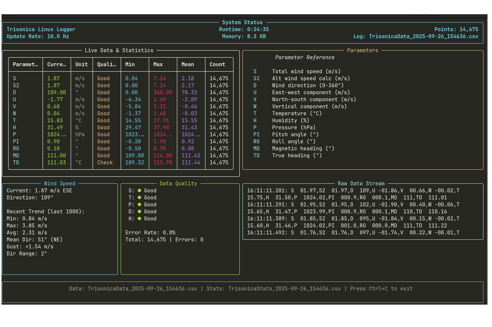

# Trisonica Data Logger - Linux Version

Data logging and visualization tool for Trisonica ultrasonic anemometer on Linux systems.
Tested with the Li-550P anemometer by LI-COR in combination with the USB-C adapter module.

[](https://www.youtube.com/watch?v=YOUR_VIDEO_ID](https://youtu.be/PLzlLJtpavw?si=o1XK-xcTCDCOfibr))




## Features

- **Real-time data logging** with Rich-based terminal interface
- **Auto-detection** of Trisonica devices on serial ports
- **CSV data export** with dynamic column management
- **Statistics tracking** with min/max/mean/std calculations
- **Data visualization** with time-series plots and wind roses
- **Error handling** and data quality monitoring

## Requirements

```bash
pip install serial pyserial rich pandas matplotlib windrose
```

## Configure the Trisonica
```bash
screen /dev/ttyUSB0 115200
```
Make sure to use the actual port name the trisonica is connected to.


Gives you the raw datastream once the anemometer connected and running. 


Pressing ESC will quit the datastream and opens the trisonica configuration settings.


## Usage

### Data Logging

```bash
# Auto-detect Trisonica and start logging
python datalogger.py

# Specify serial port
python datalogger.py --port /dev/ttyUSB0

# Custom log directory
python datalogger.py --log-dir /path/to/logs

# Hide raw data stream
python datalogger.py --hide-raw

# Disable statistics logging
python datalogger.py --no-stats
```

### Data Visualization

```bash
# Visualize specific files
python DataVis.py file1.csv file2.csv

# Process all CSV files in directory
python DataVis.py --dir /path/to/logs

# Recursive search in subdirectories
python DataVis.py --dir /path/to/logs --recursive

# Custom output directory
python DataVis.py --output /path/to/plots file.csv
```

### Testing

```bash
python test_datalogger.py
```

## Data Output

### Log Files (OUTPUT/)
- `TrisonicaData_YYYY-MM-DD_HHMMSS.csv` - Main data log
- `TrisonicaStats_YYYY-MM-DD_HHMMSS.csv` - Statistics summary

### Plot Files (PLOTS/)
- Individual parameter plots (e.g., `S_filename.png`, `T_filename.png`)
- `WindRose_filename.png` - Wind pattern visualization
- `Summary_filename.png` - Multi-parameter overview

## Error Handling and Data Quality

- **Error detection** for sensor malfunctions and invalid readings
- **Temperature validation** (negative values flagged as errors)
- **Filters out error values** (-99.50, -99.70, and other sensor error codes)
- **Tracks sensor health** and data quality metrics
- **Error statistics** in real-time console and Stats CSV files
- **Common error sources**:
  - Poor anemometer placement (primary cause - anemometer head needs clearance)
  - Loose wire connections (secure all connections)
  - Ultrasonic path interference from nearby obstacles
- **Data quality target**: Error rate should be < 5% for reliable measurements

## Anemometer Placement (Critical for Data Quality)

**IMPORTANT**: Proper placement is essential for accurate readings
- **Minimum clearance**: 3-5 meters from obstacles in all directions
- **Avoid**: Buildings, trees, walls, vehicles, or other obstructions
- **Ultrasonic sensors** are highly sensitive to reflections and turbulence
- **Poor placement** is the primary cause of corrupted/error readings
- **Ideal setup**: Open field with unobstructed airflow

## Platform Support

Optimized for Linux but portable to other Unix-like systems. Serial port patterns:
- `/dev/ttyUSB*` - USB-to-serial adapters
- `/dev/ttyACM*` - USB CDC devices
- `/dev/ttyS*` - Traditional serial ports
- `/dev/serial/by-id/*` - Persistent device names
